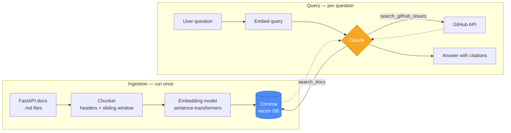
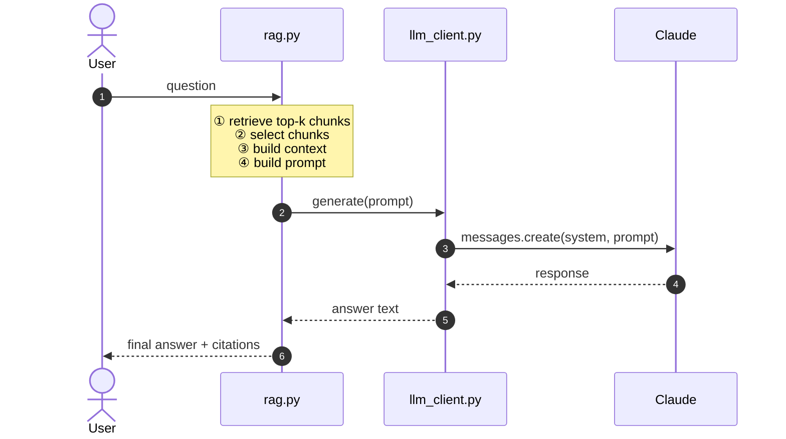

# FastAPI Docs Agent

A retrieval-augmented, tool-using assistant that answers questions about
[FastAPI](https://fastapi.tiangolo.com) by searching its official
documentation — and falls back to searching GitHub issues on the
`fastapi/fastapi` repo when the docs don't have the answer.

Built as a hands-on learning project to practice the core skills behind
production RAG systems: document chunking, embeddings, vector search,
grounded generation, and agentic tool use with Claude.

## Why this project

Enterprise knowledge search — "let people ask questions against a large,
evolving set of documents and get grounded, cited answers" — is one of the
most common applied-AI use cases in industry today (internal wikis,
customer support, developer docs). This project reproduces that pattern on
a real, sizable public documentation set (153 files / ~1,284 chunks) from
FastAPI, chosen because it's well-structured, code-heavy (a realistic
stress test for retrieval), and free of any data/privacy concerns.

## Architecture

There are two separate flows: one that builds the index (run once, or
whenever the docs change), and one that runs per question.



Two answer modes are implemented, so the difference between a fixed
pipeline and an agentic one is visible directly in this repo:

- **Plain RAG** (`src/rag.py`) — a fixed pipeline: retrieve top-k chunks,
  then one Claude call with that context as a source of truth.
- **Agentic RAG** (`src/agent.py`) — Claude is given both tools
  (`search_docs`, `search_github_issues`) and a system prompt, and decides
  for itself whether to search the docs, search GitHub, both, or neither,
  and how many times, before answering.

## Request flow

How a single question moves through the plain-RAG path, step by step:



The agentic path (`src/agent.py`) follows the same shape but loops: Claude
can request a tool call instead of a final answer, the tool result is fed
back in, and this repeats (bounded by `MAX_TOOL_ITERATIONS`) until Claude
returns a plain-text answer.

## Project status

| Step | Status |
|---|---|
| Fetch FastAPI documentation (`data/raw_docs/`) | done |
| Header-aware markdown chunking (`src/chunking.py`) | done |
| Bug fixes + data hygiene + unit tests | done |
| Embeddings + vector store (`src/embeddings.py`, `src/ingest.py`, `src/retriever.py`) | done |
| Plain RAG answer generation (`src/rag.py`) | done |
| Agentic RAG with tool use (`src/agent.py`, `src/tools/github_search.py`) | done |
| CLI + retrieval evaluation (`src/cli.py`, `tests/eval_retrieval.py`) | done |

## Setup

```bash
python3 -m venv .venv
source .venv/bin/activate      # Windows: .venv\Scripts\activate
pip install -r requirements.txt

cp .env.example .env            # then add your ANTHROPIC_API_KEY
```

`GITHUB_TOKEN` in `.env` is optional — without it, GitHub issue search
still works but uses the unauthenticated (lower) rate limit.

### Build the index

Run once, or again any time `data/raw_docs/` changes:

```bash
python -m src.ingest
```

## Usage

```bash
# No API key needed — inspect retrieval only:
python -m src.cli --retrieve-only "how do I add CORS middleware?"

# Plain RAG (needs ANTHROPIC_API_KEY):
python -m src.cli --plain "how do I add CORS middleware?"

# Agentic RAG with tool use (needs ANTHROPIC_API_KEY):
python -m src.cli "why does my websocket endpoint disconnect immediately?"
```

## Evaluation

Retrieval quality is measured separately from answer quality, since a RAG
system can only be as good as what it retrieves. `tests/eval_retrieval.py`
runs 15 hand-written questions with known-correct source documents and
reports hit-rate@k — whether the correct doc appears in the top-k results
— without calling Claude at all:

```bash
python -m tests.eval_retrieval
```

Current results on this repo's index:

| Metric | Score |
|---|---|
| hit-rate@1 | 73% (11/15) |
| hit-rate@3 | 100% (15/15) |
| hit-rate@5 | 100% (15/15) |

The correct document is almost always in the top 3, even when it's not the
single top result — a healthy sign for the generation step, since Claude
sees enough of the right context even on an imperfect top-1 match.

## Project structure
src/
chunking.py header-aware markdown chunking
embeddings.py text -> vector (sentence-transformers)
ingest.py builds the vector index (run once)
retriever.py query-time vector search
llm_client.py Anthropic client wrapper
rag.py plain RAG answer generation
agent.py agentic RAG with tool use
cli.py command-line entry point
tools/
github_search.py GitHub issue/PR search tool
data/
raw_docs/ FastAPI documentation (from fastapi/fastapi, docs/en/docs)
chroma_db/ vector index (generated, not committed)
tests/
test_chunking.py unit tests for the chunking logic
eval_questions.json 15 question / expected-source pairs
eval_retrieval.py retrieval hit-rate evaluation


## Troubleshooting

- **`ModuleNotFoundError` for `chromadb` / `sentence_transformers` /
  `anthropic`** — the virtual environment isn't activated, or
  dependencies weren't installed. Run `source .venv/bin/activate` then
  `pip install -r requirements.txt`.
- **`chromadb.errors.NotFoundError: Collection [fastapi_docs] does not
  exist`** — the vector index hasn't been built yet (or was deleted). Run
  `python -m src.ingest`; it's fully reproducible from `data/raw_docs/`.
- **`anthropic.AuthenticationError: API key is invalid`** — `.env` is
  missing `ANTHROPIC_API_KEY`, or the key was revoked/expired. Generate a
  new one at [console.anthropic.com](https://console.anthropic.com) and
  update `.env` — never commit the real key.
- **"You are sending unauthenticated requests to the HF Hub" warning** —
  harmless; it's from `sentence-transformers` downloading the embedding
  model without a Hugging Face token. Doesn't affect functionality.
- **`python: command not found` even with the venv activated** — the
  venv's `python` symlink may point at a broken/uninstalled interpreter
  (e.g. an old conda install). Recreate it:
  `rm -rf .venv && python3 -m venv .venv && source .venv/bin/activate && pip install -r requirements.txt`.

## Data source

Documentation content: [fastapi/fastapi](https://github.com/fastapi/fastapi),
`docs/en/docs/`, used here for a non-commercial learning/portfolio project.